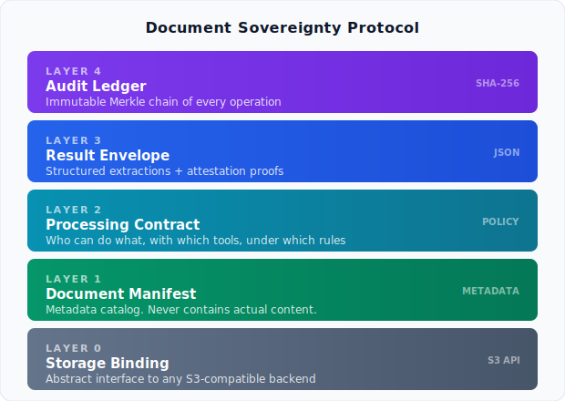

# Document Sovereignty Protocol (DSP)

An open protocol for processing sensitive documents without the documents ever leaving the owner's infrastructure.

**Status:** Draft v0.1 | **License:** Apache 2.0

[Specification](spec/dsp-v0.1.md) · [API (OpenAPI 3.1)](spec/dsp-api-v0.1.yaml) · [Quick Start](#quick-start) · [Example](examples/bank-statement-extraction/) · [Governance](GOVERNANCE.md)

---

## What is this

Organizations in regulated industries (banking, audit, healthcare, legal) need external parties to process their documents. Today that means uploading documents to a third-party platform and hoping for the best. There's no standard way to let someone process your documents while you keep control of them.

DSP fixes that. Documents stay on the owner's storage. Processing happens in attested enclaves on the owner's infrastructure. Only structured, PII-redacted results come out. Everything is logged in a tamper-proof audit chain.

The owner decides who can process what, with which tools, under which rules. And can revoke access at any time.

## How it works

DSP has five layers:



Full architecture:


The flow:

1. Owner publishes a manifest describing their documents (metadata only, never content)
2. Owner issues a contract specifying what a consumer can do
3. Consumer's agent boots inside an enclave, proves its identity via hardware attestation
4. Gateway validates the attestation, issues a scoped session token
5. Agent downloads documents from the owner's storage, processes them inside the enclave
6. Agent redacts PII, scans results for residual leakage, submits structured results
7. Gateway validates results against the contract, appends audit events to the Merkle chain
8. Owner can audit the entire trail at any time

## Quick start

```bash
git clone https://github.com/aminueza/dssp-protocol.git
cd dsp-protocol/reference
docker compose up --build
```

Four containers:

| Container | What it does |
|-----------|-------------|
| `storage` | MinIO instance acting as the owner's document storage |
| `gateway` | DSP Gateway. Validates contracts, enforces rules, keeps the audit trail |
| `setup` | Uploads sample bank statements, registers a manifest and contract |
| `agent` | Downloads docs, extracts data, redacts PII, submits results |

Once running:

- Dashboard: http://localhost:8080
- MinIO console: http://localhost:9101 (user: `dsp-owner`, password: `dsp-owner-secret-key`)

The agent will process two sample bank statements, redact all PII, scan for residual leakage, and submit a validated result. Takes about 5 seconds.

## AI/LLM support

DSP handles AI-specific risks that generic data protocols ignore:

- **Agent type declarations.** Contracts specify whether the agent is `deterministic`, `ml_structured`, or `llm_freeform`. Different rules apply to each.
- **Sub-agent chain attestation.** If the agent uses multiple models in a pipeline, every model must be declared and attested.
- **Result scanning.** Regex, NER, and statistical scanners check results for PII before they exit.
- **Prompt injection defense.** Contracts can require document sanitization before any model sees the content.
- **Numeric precision policies.** Prevents data exfiltration through unnecessary decimal precision.
- **Privacy budgets.** K-anonymity and differential privacy controls limit information leakage across sessions.

## Security model

No single mechanism is trusted alone:

```
Contract rules          what the agent is ALLOWED to do
Enclave attestation     proof the agent IS what it claims
PII redaction           agent removes sensitive data
Result scanning         independent check that PII is actually gone
Sidecar verifier        monitors agent network/memory behavior
Privacy budget          limits cumulative information extraction
Merkle audit chain      tamper-proof record of everything
```

## Storage

DSP does not mandate a storage provider. Layer 0 abstracts over any S3-compatible backend: MinIO, AWS S3, Azure Blob, GCS, or whatever the owner already uses.

## Repository structure

```
dsp-protocol/
├── spec/                           Protocol specification + OpenAPI
├── schemas/                        JSON Schemas (manifest, contract, result, audit, etc.)
├── reference/
│   ├── gateway/                    DSP Gateway (Go)
│   ├── agent/                      Processing agent (Python, pluggable attestation)
│   ├── scanner/                    PII result scanner
│   ├── sidecar/                    Sidecar verifier
│   ├── validator/                  Schema validator
│   ├── conformance/                Conformance test suite
│   ├── test-vectors/               Interoperability test vectors
│   └── docker-compose.yml          Full demo stack
├── examples/                       Complete lifecycle examples
├── ARCHITECTURE.md                 Component architecture guide
├── GOVERNANCE.md                   RFC process and governance
└── LICENSE                         Apache 2.0
```

See [ARCHITECTURE.md](ARCHITECTURE.md) for details on each component.

## Enclave support

The reference agent supports pluggable attestation backends:

| Backend | Hardware required | Use case |
|---------|-------------------|----------|
| `simulated` | None | Development and demos (default) |
| `gramine-direct` | None | Gramine simulation without SGX hardware |
| `gramine-sgx` | Intel SGX | Production |
| `nitro` | AWS Nitro | Production |

```bash
# Gramine (simulation)
docker compose -f docker-compose.yml -f docker-compose.gramine.yml up --build

# Gramine + real SGX
docker compose -f docker-compose.yml -f docker-compose.gramine.yml \
    -f docker-compose.sgx.yml up --build
```

## Conformance

Three levels:

| Level | What it requires |
|-------|-----------------|
| **Core** | Manifest + contract + result validation, Merkle audit chain |
| **Attested** | Core + real hardware attestation (not simulated) |
| **Sovereign** | Attested + PII scanning + privacy budgets + sidecar verification |

```bash
cd reference/conformance
pip install -e ".[test]"
pytest -v
```

## Target regulations

DSP was designed for environments governed by GDPR, HIPAA, PCI DSS, SOC 2, ISAE 3402 / SOC 1, NIS2, and DORA. It doesn't replace these frameworks. It provides the technical infrastructure to implement their requirements in a verifiable way.

## FAQ

**Is this a product?**
No. DSP is a protocol specification. Anyone can implement it.

**Does the gateway see the documents?**
No. Documents flow directly from the owner's storage to the enclave agent. The gateway only sees metadata, contracts, and sanitized results.

**What if the agent uses an LLM?**
The contract specifies which models are allowed, requires result scanning for free-text PII, and can enforce privacy budgets. External API calls can be blocked at the contract level and monitored by the sidecar.

**Can I use this without enclaves?**
For development, yes. The `simulated` backend works without special hardware. For production, you need real enclaves (SGX, SEV-SNP, TDX, or Nitro).

**How is this different from a VPN or VDI?**
A VPN gives the remote party full access to documents on screen. DSP gives structured, field-level access with PII redaction. The processor only sees extracted data they're authorized to see, never the raw document.

## Contributing

1. Read [GOVERNANCE.md](GOVERNANCE.md)
2. Open an issue to discuss your change
3. Submit a pull request

## License

Apache 2.0. See [LICENSE](LICENSE).
